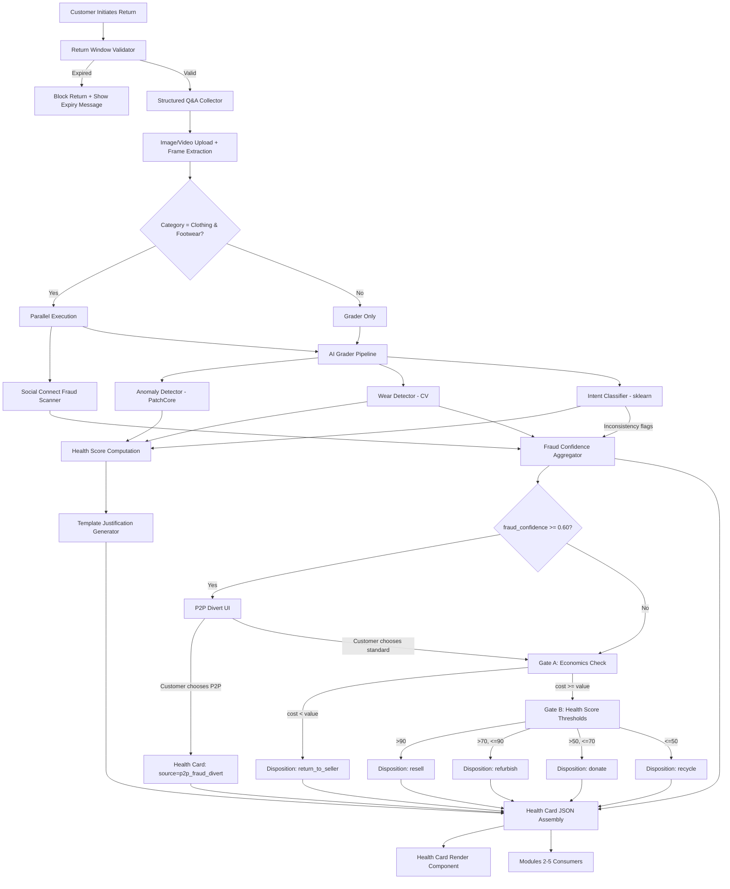
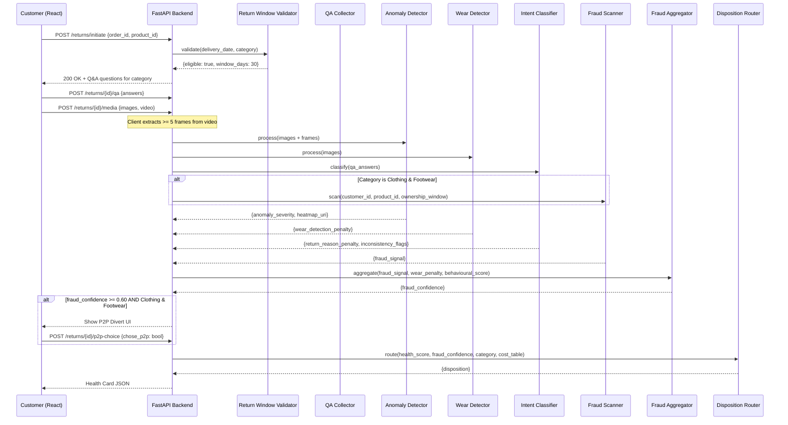

# Design Document — Grading, Fraud Detection & Quality System

## Overview

Module 1 is the core pipeline of the Second Life Commerce platform. It receives a returned item's images, video, structured Q&A answers, and catalog metadata, then produces a Health Card JSON — the inter-module contract consumed by Modules 2–5. The system runs a Social Connect fraud check (Clothing & Footwear only) and an AI grader in parallel, aggregates fraud confidence, applies two-gate disposition routing, and optionally offers a P2P fraud divert path.

**Key constraints:**

- Option B (no-VLM, fully classical) — no GPU required
- Condition assessment under 2 seconds per item
- CPU-only inference (anomalib PatchCore, scikit-learn classifier, CV wear detection)
- SQLite for demo persistence, S3 for media/heatmaps
- Health Card schema is append-only (never remove/rename fields)

**Tech stack:**

- Frontend: React (structured Q&A, image/video upload, Health Card render, P2P divert UI)
- Backend: FastAPI/Python (pipeline orchestration, routing logic, fraud aggregation)
- AI: anomalib PatchCore (anomaly detection), scikit-learn logistic regression (intent classification), OpenCV-based wear detection
- Storage: SQLite (demo), S3-compatible object store (heatmaps, media)

## Architecture

### High-Level System Diagram



### Request Flow Sequence



### Deployment Architecture

```
┌─────────────────────────────────────────────────┐
│  Client (React SPA)                             │
│  - Q&A forms, image upload, video frame extract │
│  - Health Card render, P2P divert UI            │
└────────────────────┬────────────────────────────┘
                     │ HTTP/REST
┌────────────────────┴────────────────────────────┐
│  FastAPI Backend (single service)               │
│  - Pipeline orchestrator (asyncio.gather)       │
│  - Return window validator                      │
│  - Intent classifier (sklearn in-process)       │
│  - Anomaly detector (anomalib in-process)       │
│  - Wear detector (OpenCV in-process)            │
│  - Fraud scanner (mock social API client)       │
│  - Fraud aggregator                             │
│  - Disposition router                           │
│  - Template justification engine                │
│  - Health Card assembler                        │
└────────────────────┬────────────────────────────┘
                     │
         ┌───────────┴───────────┐
         │                       │
┌────────┴────────┐   ┌─────────┴─────────┐
│  SQLite (demo)  │   │  S3 / Local FS    │
│  - returns      │   │  - images         │
│  - health_cards │   │  - heatmaps       │
│  - cost_table   │   │  - video frames   │
│  - config       │   │                   │
└─────────────────┘   └───────────────────┘
```

## Components and Interfaces

### 1. Return Window Validator

**Responsibility:** Determines if a return is within the allowed window for its product category.

**Interface:**

```python
class ReturnWindowValidator:
    def validate(self, delivery_date: date, category: str) -> ReturnWindowResult:
        """
        Returns eligibility status.
        Raises ServiceError if delivery_date or config unavailable.
        """
        ...

@dataclass
class ReturnWindowResult:
    eligible: bool
    window_days: int
    days_elapsed: int
    expiry_date: date
    message: str | None  # error/expiry message when ineligible
```

**Configuration:**
| Category | Window (days) |
|----------|--------------|
| Food & Grocery | 7 |
| Electronics | 30 |
| Clothing & Footwear | 15 |
| Other | 30 |
| Default (fallback) | 30 |

### 2. QA Collector

**Responsibility:** Serves category-specific question sets, validates completeness, and emits structured key-value answers.

**Interface:**

```python
class QACollector:
    def get_questions(self, category: str) -> list[Question]:
        """Returns ordered question set for the category."""
        ...

    def validate_answers(self, category: str, answers: dict[str, str]) -> ValidationResult:
        """Checks all required questions are answered."""
        ...

@dataclass
class Question:
    id: str
    text: str
    options: list[str]
    supplementary_input: SupplementaryInput | None  # text_field or date_picker
    conditional_display: str | None  # e.g., "footwear_only"

@dataclass
class SupplementaryInput:
    type: Literal["text_field", "date_picker"]
    max_length: int | None  # 200 for text fields
```

### 3. Anomaly Detector

**Responsibility:** Runs PatchCore/FastFlow inference on item images, producing a heatmap and severity score.

**Interface:**

```python
class AnomalyDetector:
    def detect(self, images: list[np.ndarray], category: str) -> AnomalyResult:
        """
        Processes images through the category-specific PatchCore model.
        Returns max severity across all images.
        Timeout: 1500ms.
        """
        ...

@dataclass
class AnomalyResult:
    anomaly_severity: float  # 0.0–1.0, max across images
    heatmap_uri: str         # S3/local URI of the pixel-level heatmap
    model_available: bool
    failure_reason: str | None
```

### 4. Wear Detector

**Responsibility:** Analyzes images for physical use evidence (sole wear, fabric stress, stains, tag condition).

**Interface:**

```python
class WearDetector:
    def detect(self, images: list[np.ndarray], category: str) -> WearResult:
        """
        Category-aware wear analysis.
        Timeout: 800ms.
        """
        ...

@dataclass
class WearResult:
    wear_detection_penalty: float  # 0.0–1.0
    wear_indicators: list[str]     # e.g., ["sole_wear", "fabric_stress"]
    analysis_performed: bool
```

### 5. Intent Classifier

**Responsibility:** Maps structured Q&A answers to a return_reason_penalty and detects Q&A-to-CV inconsistencies.

**Interface:**

```python
class IntentClassifier:
    def classify(self, qa_answers: dict[str, str], category: str) -> IntentResult:
        """
        Classification within 200ms.
        """
        ...

@dataclass
class IntentResult:
    return_reason_penalty: float       # 0.05–0.35
    penalty_category: Literal["high", "medium", "low"]
    inconsistency_flags: list[str]     # e.g., ["never_used_but_wear_detected"]
    unclassified: bool                 # true if default penalty applied
```

### 6. Health Score Computer

**Responsibility:** Applies the weighted formula to compute the final health score and breakdown.

**Interface:**

```python
class HealthScoreComputer:
    def compute(
        self,
        anomaly_severity: float,
        defect_penalty: float,
        return_reason_penalty: float,
        wear_detection_penalty: float,
        category: str
    ) -> HealthScoreResult:
        """
        Formula: 100 - (w1*anomaly + w2*defect + w3*reason + w4*wear)
        Clamped to [0, 100]. Completes within 100ms.
        """
        ...

@dataclass
class HealthScoreResult:
    health_score: int                # 0–100 (clamped)
    breakdown: ScoreBreakdown
    condition: Literal["Excellent", "Good", "Fair", "Poor"]

@dataclass
class ScoreBreakdown:
    w1_anomaly_contribution: float
    w2_defect_contribution: float
    w3_reason_contribution: float
    w4_wear_contribution: float
```

### 7. Fraud Scanner (Social Connect)

**Responsibility:** Scans connected public social profiles for visual matches of the returned product within the ownership window.

**Interface:**

```python
class FraudScanner:
    def scan(
        self,
        customer_id: str,
        product_images: list[str],  # catalog reference image URIs
        ownership_window: tuple[date, date],
        connected_accounts: list[str]
    ) -> FraudScanResult:
        """
        Only executes for Clothing & Footwear.
        Match threshold: 0.70.
        """
        ...

@dataclass
class FraudScanResult:
    social_scan_performed: bool
    accounts_scanned: list[str]
    product_found_in_social: bool
    fraud_confidence: float          # 0.0–1.0
    evidence_posts: list[EvidencePost]
    scan_window: dict[str, str]      # {"from": "...", "to": "..."}

@dataclass
class EvidencePost:
    platform: str
    post_date: str
    match_confidence: float
    post_type: str
```

### 8. Fraud Confidence Aggregator

**Responsibility:** Merges social signal, wear detection, and behavioural signals into a single fraud_confidence.

**Interface:**

```python
class FraudAggregator:
    def aggregate(
        self,
        social_signal: float | None,   # None if scan not performed
        wear_penalty: float,
        behavioural_score: float,
        social_scan_performed: bool
    ) -> float:
        """
        Weighted sum with proportional redistribution when signals missing.
        Completes within 50ms.
        Returns fraud_confidence 0.0–1.0.
        """
        ...
```

### 9. Disposition Router

**Responsibility:** Applies Gate A (economics), Gate B (health score thresholds), category-specific overrides, and safety/hygiene holds.

**Interface:**

```python
class DispositionRouter:
    def route(
        self,
        health_score: int,
        fraud_confidence: float,
        category: str,
        qa_answers: dict[str, str],
        product_value: float
    ) -> DispositionResult:
        """
        Gate A → Gate B → category overrides → safety holds.
        Completes within 200ms.
        """
        ...

@dataclass
class DispositionResult:
    disposition: str  # resell | refurbish | donate | recycle | return_to_seller | manual_review
    gate_applied: str  # "A", "B", "category_override", "safety_hold"
    flags: list[str]   # e.g., ["enhanced_inspection", "factory_reset_required"]
```

### 10. Template Justification Engine

**Responsibility:** Generates human-readable justification from scoring outputs.

**Interface:**

```python
class JustificationEngine:
    def generate(
        self,
        condition: str,
        defects: list[str],
        anomaly_severity: float,
        anomaly_threshold: float,
        functional_pass: bool,
        warranty_months: int
    ) -> str:
        """
        Template: "{condition}. Detected: {defects}. {anomaly_phrase}.
                   Functional check: {pass/fail}. Warranty: {n} months remaining."
        """
        ...
```

### 11. Health Card Assembler

**Responsibility:** Composes all pipeline outputs into the final Health Card JSON.

**Interface:**

```python
class HealthCardAssembler:
    def assemble(
        self,
        score_result: HealthScoreResult,
        anomaly_result: AnomalyResult,
        fraud_confidence: float,
        disposition_result: DispositionResult,
        justification: str,
        fraud_scan_result: FraudScanResult | None,
        p2p_offered: bool,
        customer_chose_p2p: bool,
        warranty_months: int,
        defects: list[str]
    ) -> HealthCard:
        ...
```

### 12. Pipeline Orchestrator

**Responsibility:** Coordinates the end-to-end flow with parallel execution and timeout handling.

**Interface:**

```python
class PipelineOrchestrator:
    async def execute(self, return_request: ReturnRequest) -> HealthCard | PipelineError:
        """
        Orchestrates:
        1. Return window validation
        2. Q&A + media collection (handled by frontend, arrives as input)
        3. Parallel: Grader (Anomaly + Wear + Intent) + Fraud Scanner
        4. Cross-validation & fraud aggregation
        5. Disposition routing
        6. Health Card assembly

        Total budget: 2000ms.
        Component timeout: 5000ms (individual).
        """
        ...
```

## Data Models

### Health Card JSON Schema (Inter-Module Contract)

```json
{
  "condition": "Excellent | Good | Fair | Poor",
  "health_score": 85,
  "confidence": 0.93,
  "warranty_left_months": 5,
  "defects": ["minor scratch on rear casing"],
  "anomaly_heatmap_uri": "s3://bucket/item123_heatmap.png",
  "justification": "Good. Detected: minor scratch (rear casing). No structural anomalies. Functional check: pass. Warranty: 5 months remaining.",
  "disposition": "resell | refurbish | donate | recycle | return_to_seller | manual_review",
  "source": "standard_return | p2p_fraud_divert",
  "fraud_signal": {
    "social_scan_performed": true,
    "product_found_in_social": false,
    "fraud_confidence": 0.12,
    "p2p_offered": false,
    "customer_chose_p2p": false
  }
}
```

**Schema rules:**

- Fields are never removed or renamed
- New fields are additive, optional, default to `null`
- Types are immutable (string stays string, number stays number)
- If a required field cannot be populated, include it as `null` and set `confidence: 0.0`

### SQLite Schema (Demo Persistence)

```sql
-- Return sessions
CREATE TABLE returns (
    id TEXT PRIMARY KEY,
    order_id TEXT NOT NULL,
    product_id TEXT NOT NULL,
    customer_id TEXT NOT NULL,
    category TEXT NOT NULL,
    delivery_date TEXT NOT NULL,  -- ISO 8601
    initiated_at TEXT NOT NULL,   -- ISO 8601
    status TEXT NOT NULL DEFAULT 'initiated',  -- initiated | qa_complete | grading | complete | error
    qa_answers TEXT,              -- JSON blob
    media_uris TEXT,              -- JSON array of S3/local URIs
    created_at TEXT NOT NULL DEFAULT (datetime('now'))
);

-- Health Cards (one per completed return)
CREATE TABLE health_cards (
    id TEXT PRIMARY KEY,
    return_id TEXT NOT NULL REFERENCES returns(id),
    health_card_json TEXT NOT NULL,  -- Full Health Card JSON
    created_at TEXT NOT NULL DEFAULT (datetime('now'))
);

-- Cost lookup table
CREATE TABLE cost_lookup (
    category TEXT PRIMARY KEY,
    reverse_logistics REAL NOT NULL,
    inspection REAL NOT NULL,
    refurbishment REAL NOT NULL,
    storage REAL NOT NULL,
    total_processing_cost REAL GENERATED ALWAYS AS (
        reverse_logistics + inspection + refurbishment + storage
    ) STORED
);

-- Category weight configuration
CREATE TABLE category_weights (
    category TEXT PRIMARY KEY,
    w1_anomaly REAL NOT NULL DEFAULT 30.0,
    w2_defect REAL NOT NULL DEFAULT 25.0,
    w3_reason REAL NOT NULL DEFAULT 20.0,
    w4_wear REAL NOT NULL DEFAULT 25.0
);

-- Return window configuration
CREATE TABLE return_windows (
    category TEXT PRIMARY KEY,
    window_days INTEGER NOT NULL DEFAULT 30
);
```

### API Contracts

#### POST /api/returns/initiate

**Request:**

```json
{
  "order_id": "ORD-123456",
  "product_id": "PROD-789",
  "customer_id": "CUST-001"
}
```

**Response (200):**

```json
{
  "return_id": "RET-abc123",
  "eligible": true,
  "window_days": 30,
  "days_elapsed": 12,
  "category": "Electronics",
  "questions": [
    {
      "id": "return_reason",
      "text": "What is the reason for your return?",
      "options": ["Item is defective / not working", "..."],
      "supplementary_input": null,
      "conditional_display": null
    }
  ]
}
```

**Response (403 — window expired):**

```json
{
  "return_id": null,
  "eligible": false,
  "message": "Return window expired on 2026-06-01. Returns must be initiated within 30 days of delivery.",
  "expiry_date": "2026-06-01"
}
```

#### POST /api/returns/{return_id}/submit

**Request:**

```json
{
  "qa_answers": {
    "return_reason": "Item is defective / not working",
    "functional_status": "Not functional — does not power on / completely broken",
    "physical_condition": "Minor cosmetic damage (light scratches, small dents)",
    "accessories": "Yes — all accessories present",
    "original_packaging": "Yes — original box with all inserts",
    "ownership_duration": "Used briefly (less than a week)",
    "factory_reset": "Yes — fully reset, personal data removed",
    "liquid_damage": "No — never exposed to liquid or impact"
  },
  "image_uris": ["s3://uploads/img1.jpg", "s3://uploads/img2.jpg"],
  "video_frame_uris": [
    "s3://uploads/frame1.jpg",
    "s3://uploads/frame2.jpg",
    "s3://uploads/frame3.jpg",
    "s3://uploads/frame4.jpg",
    "s3://uploads/frame5.jpg"
  ],
  "catalog_metadata": {
    "category": "Electronics",
    "original_price": 24999.0,
    "purchase_date": "2026-05-01",
    "warranty_remaining_months": 5
  }
}
```

**Response (200):**

```json
{
  "health_card": { "...full Health Card JSON..." },
  "p2p_divert_offered": false
}
```

#### POST /api/returns/{return_id}/p2p-choice

**Request:**

```json
{
  "chose_p2p": true
}
```

**Response (200):**

```json
{
  "health_card": { "...updated Health Card with source=p2p_fraud_divert..." }
}
```

### Fraud Signal Data Model

```python
@dataclass
class FraudSignal:
    social_scan_performed: bool
    product_found_in_social: bool
    fraud_confidence: float        # 0.0–1.0
    p2p_offered: bool
    customer_chose_p2p: bool
```

### Weight Configuration (per category)

| Category            | w1 (anomaly) | w2 (defect) | w3 (reason) | w4 (wear) |
| ------------------- | ------------ | ----------- | ----------- | --------- |
| Food & Grocery      | 20.0         | 30.0        | 30.0        | 20.0      |
| Electronics         | 30.0         | 25.0        | 25.0        | 20.0      |
| Clothing & Footwear | 20.0         | 20.0        | 20.0        | 40.0      |
| Other               | 25.0         | 25.0        | 25.0        | 25.0      |

### Disposition Gate Configuration

**Gate A:**

- Compare `total_processing_cost` (from cost_lookup table) against `original_price`
- If cost < price → `return_to_seller`
- If cost >= price → proceed to Gate B

**Gate B thresholds:**
| Health Score Range | Disposition |
|-------------------|-------------|
| > 90 | resell |
| > 70, <= 90 | refurbish |
| > 50, <= 70 | donate |
| <= 50 | recycle |

**P2P Divert threshold:** `fraud_confidence >= 0.60` AND category is Clothing & Footwear

## Correctness Properties

_A property is a characteristic or behavior that should hold true across all valid executions of a system — essentially, a formal statement about what the system should do. Properties serve as the bridge between human-readable specifications and machine-verifiable correctness guarantees._

### Property 1: Return window eligibility is correctly computed

_For any_ delivery date, product category, and current date, the return is eligible if and only if the number of days elapsed from delivery to current date is less than or equal to the configured window for that category (or 30 days if the category has no configuration).

**Validates: Requirements 1.1, 1.3**

### Property 2: Incomplete Q&A submissions are rejected

_For any_ category-specific question set and any answer map that is missing one or more required answers, submission SHALL be rejected and the missing question IDs SHALL be reported.

**Validates: Requirements 2.7**

### Property 3: Media input validation accepts only valid uploads

_For any_ image upload set with count, formats, and file sizes, validation accepts if and only if count is between 1 and 5, all formats are JPEG or PNG, and all sizes are at most 10 MB. For any optional video with duration, size, and format, validation accepts if and only if duration is at most 15 seconds, size is at most 50 MB, and format is MP4 or WebM.

**Validates: Requirements 3.1, 3.2**

### Property 4: Video frame extraction produces evenly-spaced frames

_For any_ video with duration between 1 and 15 seconds, the frame extraction function SHALL produce at least 5 frames with timestamps evenly distributed across the video duration.

**Validates: Requirements 3.3**

### Property 5: Fraud scanner executes only for Clothing & Footwear

_For any_ product category, the Social Connect Fraud Scanner SHALL execute if and only if the category equals "Clothing & Footwear". For all other categories, social_scan_performed SHALL be false and fraud_confidence SHALL be derived from wear and behavioural signals only.

**Validates: Requirements 4.1, 5.1, 5.2, 15.6, 16.4**

### Property 6: Social match evidence is recorded above threshold

_For any_ visual match with a confidence score, the match SHALL be recorded as evidence in evidence_posts if and only if the confidence exceeds 0.70.

**Validates: Requirements 4.3, 4.4**

### Property 7: Anomaly severity is the maximum across all processed images

_For any_ set of images processed by the Anomaly Detector, the item-level anomaly_severity score SHALL equal the maximum severity value across all individual image scores.

**Validates: Requirements 6.2**

### Property 8: Intent classification assigns correct penalty values

_For any_ valid set of structured Q&A answers and product category, the Intent Classifier SHALL assign exactly one penalty category (high, medium, or low) with the corresponding return_reason_penalty: high yields 0.25 or 0.35, medium yields 0.15, low yields 0.05 or 0.10. If the answers cannot be mapped to any category, medium (0.15) is assigned by default.

**Validates: Requirements 8.1, 8.2, 8.5**

### Property 9: Health score formula is correctly applied and clamped

_For any_ component scores (anomaly_severity, defect_penalty, return_reason_penalty, wear_detection_penalty) each in [0.0, 1.0] and any non-negative category weights (w1, w2, w3, w4) each in [0.0, 100.0], the health_score SHALL equal `clamp(100 - (w1*anomaly_severity + w2*defect_penalty + w3*return_reason_penalty + w4*wear_detection_penalty), 0, 100)` rounded to an integer.

**Validates: Requirements 9.1, 9.2, 9.3**

### Property 10: Score breakdown sums to total penalty

_For any_ health score computation, the sum of the four weighted contributions (w1·anomaly, w2·defect, w3·reason, w4·wear) in the breakdown SHALL equal (100 - health_score) when health_score is not clamped, or SHALL equal or exceed 100 when clamped to 0.

**Validates: Requirements 9.6**

### Property 11: Condition label and anomaly phrase are correctly mapped

_For any_ health_score in [0, 100], the condition label SHALL be "Excellent" if score > 90, "Good" if score > 70 and ≤ 90, "Fair" if score > 50 and ≤ 70, "Poor" if score ≤ 50. For any anomaly_severity and configured threshold T, the anomaly phrase SHALL be "No structural anomalies" if severity < T, "Minor anomalies detected" if severity ≥ T and < 2T, "Significant anomalies detected" if severity ≥ 2T.

**Validates: Requirements 10.2, 10.5**

### Property 12: Justification template includes all required components

_For any_ valid set of scoring outputs (condition, defects, anomaly_severity, functional_pass, warranty_months), the generated justification string SHALL contain: the condition label, defect list (or "none"), anomaly phrase, functional check result ("pass" or "fail"), and warranty months as an integer.

**Validates: Requirements 10.1, 10.3, 10.4**

### Property 13: Fraud confidence aggregation with proportional weight redistribution

_For any_ combination of available signals (social_signal, wear_penalty, behavioural_score) and configurable weights that sum to 1.0, the fraud_confidence SHALL be computed as the weighted sum of available signals using proportionally redistributed weights when one or more signals are missing. The absence of social data SHALL not inflate or deflate the score. The result SHALL be in [0.0, 1.0].

**Validates: Requirements 11.1, 11.3, 11.4**

### Property 14: Gate A routes correctly based on cost vs value

_For any_ (total_processing_cost, product_value) pair where both are non-negative, if total_processing_cost < product_value then disposition SHALL be "return_to_seller"; if total_processing_cost ≥ product_value then the item SHALL proceed to Gate B for threshold-based routing.

**Validates: Requirements 13.1, 13.2, 13.3**

### Property 15: Gate B assigns disposition by health score thresholds

_For any_ health_score in [0, 100] routed to Gate B, disposition SHALL be: "resell" if score > 90, "refurbish" if score > 70 and ≤ 90, "donate" if score > 50 and ≤ 70, "recycle" if score ≤ 50.

**Validates: Requirements 14.1, 14.2, 14.3, 14.4**

### Property 16: Health Card source field reflects P2P choice

_For any_ completed return, if fraud_confidence ≥ 0.60 AND category is Clothing & Footwear AND customer chose P2P, then source SHALL be "p2p_fraud_divert" and customer_chose_p2p SHALL be true. In all other cases, source SHALL be "standard_return".

**Validates: Requirements 12.4, 12.5, 15.3**

### Property 17: Food & Grocery safety overrides bypass normal routing

_For any_ Food & Grocery item, if the seal is broken OR quantity is partially/mostly consumed OR the expiry date is before the return date, disposition SHALL be "recycle" regardless of health_score, Gate A, or Gate B outcomes. If sealed AND unexpired AND return reason is "Wrong item delivered", disposition SHALL be "return_to_seller".

**Validates: Requirements 19.1, 19.2, 19.3, 19.4**

### Property 18: Safety and hygiene overrides bypass automatic disposition

_For any_ item flagged with a safety concern (across all categories), disposition SHALL be "manual_review" bypassing all automatic gates. For any "Other" category item used on skin/body, resell and refurbish SHALL be blocked — disposition SHALL be "donate" if condition is good or "recycle" if condition is poor. For any Electronics item with unreset personal data, disposition SHALL be "manual_review" with a factory_reset_required flag.

**Validates: Requirements 20.1, 20.2, 20.3**

### Property 19: Cross-validation uses the more pessimistic signal

_For any_ item where both Q&A-derived penalty and CV-detected penalty are available, the authoritative penalty used for health score calculation SHALL be the maximum (more pessimistic) of the two values. When Q&A reports "never used" but wear_detection_penalty > 0, fraud_confidence SHALL be escalated by a factor in [0.10, 0.40].

**Validates: Requirements 21.1, 21.3**

## Error Handling

### Component Failure Strategies

| Component               | Failure Mode                            | Response                                                                              |
| ----------------------- | --------------------------------------- | ------------------------------------------------------------------------------------- |
| Return Window Validator | Cannot retrieve delivery date or config | Return error message, prompt retry (Req 1.5)                                          |
| Anomaly Detector        | Image corruption / model error          | Set anomaly_severity = 1.0 (worst case), record failure reason in defects (Req 6.5)   |
| Anomaly Detector        | No trained model for category           | Set anomaly_severity = 0.0 (no penalty), record "anomaly_model_unavailable" (Req 6.6) |
| Wear Detector           | Images unavailable / processing failure | Set wear_detection_penalty = 0.0, flag analysis_performed = false (Req 7.5)           |
| Intent Classifier       | Cannot map answer to penalty category   | Assign medium penalty (0.15), set unclassified_intent flag (Req 8.5)                  |
| Fraud Scanner           | Social API error / unavailable          | Set social_scan_performed = false, log error, proceed without social data (Req 4.8)   |
| Fraud Aggregator        | Missing component signal                | Treat as 0.0, redistribute weights proportionally (Req 11.4)                          |
| Grader (entire)         | Timeout or complete failure             | No Health Card produced, return error identifying failed component (Req 5.6, 12.6)    |
| Disposition Router      | Category not in cost table              | Route to manual_review queue (Req 13.5)                                               |
| Health Card Assembly    | Required field cannot be populated      | Include field as null, set confidence = 0.0 (Req 18.4)                                |
| Image/Video Upload      | Network error or invalid file           | Display failure reason, allow retry without losing other uploads (Req 3.5)            |
| P2P Divert UI           | 30-minute timeout with no selection     | Treat as standard return, set enhanced_inspection flag (Req 15.5)                     |

### Timeout Budget

```
Total pipeline budget: 2000ms
├── Anomaly Detector:     1500ms max
├── Wear Detector:         800ms max
├── Intent Classifier:     200ms max
├── Fraud Scanner:        1500ms max (parallel with grader)
├── Fraud Aggregator:       50ms max
├── Health Score Compute:  100ms max
├── Disposition Router:    200ms max
└── Component hard timeout: 5000ms (terminates component)
```

The parallel execution model means the Fraud Scanner and Grader sub-pipeline run concurrently. The critical path for non-clothing items is: Anomaly Detector (1500ms) → Health Score (100ms) → Disposition (200ms) = ~1800ms. For clothing items, Fraud Scanner (1500ms) runs in parallel, so the critical path is the same.

### Graceful Degradation Hierarchy

1. **Full pipeline** — all components succeed → highest confidence Health Card
2. **No social data** — Fraud Scanner skipped or failed → proceed with wear + behavioural signals only
3. **No anomaly model** — Anomaly Detector has no trained model → severity = 0.0, reduced confidence
4. **Partial grader failure** — one component fails → use available signals, note reduced confidence
5. **Complete grader failure** — no Health Card produced → error returned to caller

## Testing Strategy

### Dual Testing Approach

This feature is well-suited for property-based testing because it contains significant pure-function logic (health score formula, disposition routing, fraud aggregation, intent classification, cross-validation) with clear universal properties that hold across a wide input space.

**Property-based tests** verify:

- Universal properties that must hold for all valid inputs (Properties 1–19)
- Edge cases discovered through random input generation
- Formula correctness across the full numeric range

**Unit tests (example-based)** verify:

- Category-specific Q&A question sets (exact content and order)
- Template justification output format (concrete examples)
- Health Card render component (React component tests)
- API endpoint contracts (request/response shapes)
- Error messages and user-facing text

**Integration tests** verify:

- End-to-end pipeline timing (< 2 seconds)
- Parallel execution of Fraud Scanner and Grader
- S3/local storage for heatmaps and media
- SQLite persistence of returns and health cards
- anomalib model inference (real model, test images)

### Property-Based Testing Configuration

- **Library:** Hypothesis (Python) for backend logic
- **Minimum iterations:** 100 per property test
- **Tag format:** `Feature: grading-fraud-quality-system, Property {N}: {title}`

Each property test maps to one of the 19 correctness properties defined above:

| Property | Component Under Test               | Key Strategy                                        |
| -------- | ---------------------------------- | --------------------------------------------------- |
| 1        | ReturnWindowValidator              | Generate random dates and categories                |
| 2        | QACollector.validate_answers       | Generate random answer subsets with omissions       |
| 3        | Media validation                   | Generate random file metadata (count, format, size) |
| 4        | Frame extraction                   | Generate random durations 1–15s                     |
| 5        | PipelineOrchestrator (conditional) | Generate random categories                          |
| 6        | FraudScanner (threshold)           | Generate random confidence values                   |
| 7        | AnomalyDetector (max aggregation)  | Generate random per-image score lists               |
| 8        | IntentClassifier                   | Generate random Q&A answer combinations             |
| 9        | HealthScoreComputer                | Generate random scores and weights                  |
| 10       | HealthScoreComputer (breakdown)    | Verify sum invariant                                |
| 11       | JustificationEngine (mappings)     | Generate random scores for label/phrase             |
| 12       | JustificationEngine (template)     | Generate random scoring outputs                     |
| 13       | FraudAggregator                    | Generate random signal combinations                 |
| 14       | DispositionRouter (Gate A)         | Generate random cost/value pairs                    |
| 15       | DispositionRouter (Gate B)         | Generate random health scores                       |
| 16       | HealthCardAssembler (source)       | Generate random fraud/P2P scenarios                 |
| 17       | DispositionRouter (Food overrides) | Generate random food Q&A combinations               |
| 18       | DispositionRouter (Safety/Hygiene) | Generate random safety scenarios                    |
| 19       | CrossValidator (pessimistic)       | Generate random penalty pairs                       |

### Test File Organization

```
tests/
├── properties/           # Property-based tests (Hypothesis)
│   ├── test_return_window.py
│   ├── test_qa_validation.py
│   ├── test_media_validation.py
│   ├── test_frame_extraction.py
│   ├── test_intent_classifier.py
│   ├── test_health_score.py
│   ├── test_justification.py
│   ├── test_fraud_aggregator.py
│   ├── test_disposition_router.py
│   ├── test_health_card_assembly.py
│   └── test_cross_validation.py
├── unit/                 # Example-based unit tests
│   ├── test_qa_questions.py
│   ├── test_template_output.py
│   ├── test_api_contracts.py
│   └── test_health_card_render.tsx
├── integration/          # End-to-end and timing tests
│   ├── test_pipeline_timing.py
│   ├── test_parallel_execution.py
│   ├── test_storage.py
│   └── test_anomalib_inference.py
└── conftest.py           # Shared fixtures and Hypothesis strategies
```
